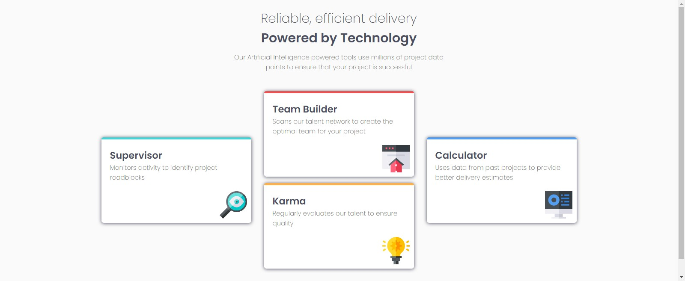

# Frontend Mentor - Four card feature section solution

This is a solution to the [Four card feature section challenge on Frontend Mentor](https://www.frontendmentor.io/challenges/four-card-feature-section-weK1eFYK). Frontend Mentor challenges help you improve your coding skills by building realistic projects. 

## Table of contents

- [Overview](#overview)
  - [The challenge](#the-challenge)
  - [Links](#links)
- [My process](#my-process)
  - [Built with](#built-with)
  - [What I learned](#what-i-learned)
  - [Continued development](#continued-development)
  - [Useful resources](#useful-resources)
- [Author](#author)
- [Acknowledgments](#acknowledgments)

## Overview

### The challenge

Users should be able to:

- View the optimal layout for the site depending on their device's screen size

### Links

- Solution URL: [https://www.frontendmentor.io/solutions/four-cards-using-htmlandcss-Pusf6Fajp](https://www.frontendmentor.io/solutions/four-cards-using-htmlandcss-Pusf6Fajp)
- Live Site URL: [https://four-cards-13ec2.web.app/](https://four-cards-13ec2.web.app/)

## My process

### Built with

- Semantic HTML5 markup
- CSS custom properties
- Flexbox

### What I learned

I learned how to make the site responsive on diffrants devices

### Continued development

I want to continue focusing on flex and the true way to use semantic html

### Useful resources

- [Example resource 1](https://www.example.com) - This helped me for XYZ reason. I really liked this pattern and will use it going forward.
- [Example resource 2](https://www.example.com) - This is an amazing article which helped me finally understand XYZ. I'd recommend it to anyone still learning this concept.

## Author

- Linkedin - [omarsaleh1](https://linkedin.com/in/omarsaleh1)
- Frontend Mentor - [@Omar](https://www.frontendmentor.io/profile/omarsaleh1)
- Twitter - [@omarsaleh239](https://www.twitter.com/omarsaleh239)

## Acknowledgments

This is where you can give a hat tip to anyone who helped you out on this project. Perhaps you worked in a team or got some inspiration from someone else's solution. This is the perfect place to give them some credit.

**Note: Delete this note and edit this section's content as necessary. If you completed this challenge by yourself, feel free to delete this section entirely.**
